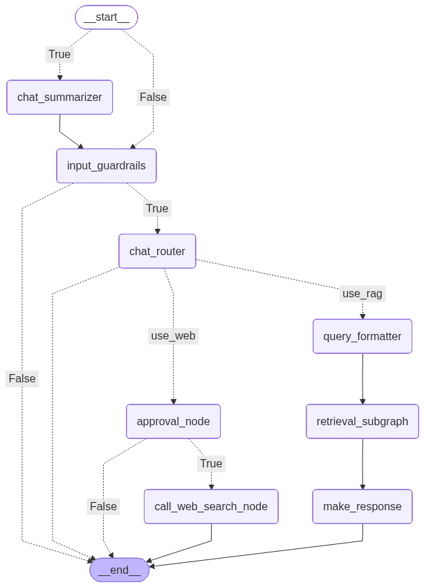

# Agentic RAG System

A sophisticated Retrieval-Augmented Generation (RAG) framework that combines the power of large language models with dynamic knowledge retrieval. The system enables complex, multi-step reasoning and information synthesis across diverse knowledge domains through its modular, agent-based architecture.

This implementation demonstrates how to build production-grade RAG applications with advanced capabilities such as:
- Multi-agent orchestration
- Dynamic workflow management
- Context-aware information retrieval
- Stateful conversation handling

## 🏗️ System Architecture

### Core Components

#### 1. Frontend Layer
- **Streamlit-based Web Interface**: Interactive chat interface for user interactions
- **Session Management**: Maintains conversation history and context

#### 2. Service Layer
- **Main Application** (`service/main.py`): Streamlit entry point handling user requests and orchestrating the RAG pipeline. Includes HITL confirmation dialog for web search operations.
- **Orchestrator** (`service/orchestrator/`): LangGraph-based workflow with Postgres-backed checkpoints and optional legacy flow:
  - `main_graph_node.py`: Primary StateGraph that routes through guardrails, chat routing, query formatting, retrieval, and response synthesis
  - `subgraph_nodes.py`: Retrieval subgraph handling embeddings, vector search (Qdrant), and user memory search (Mem0)

#### 3. Agent Layer (`service/agents/`)
- Specialized agents for different aspects of query processing:
  - `InputAgent` : Prompt safety classification guardrail
  - `ChatAgent` : Routes intent and decides `use_rag` vs `use_web`
  - `QueryAgent` : Generates up to 3 focused sub-queries
  - `ResponseAgent` : Synthesizes final answers using search results, memory, and chat history
  - Summarizer: Produces rolling chat summaries for long conversations

#### 4. Tooling Layer (`service/tools/`)
- Utility functions and integrations powering RAG:
  - `embedding_generator.py`: SentenceTransformers `Qwen/Qwen3-Embedding-0.6B`
  - `vector_store.py`: Qdrant client for similarity search
  - `reranker.py`: `Qwen/Qwen3-Reranker-0.6B` lightweight reranker
  - `memory.py`: Mem0 memory store (Qdrant backend) with optional OpenAI/HF embeddings
  - `loader.py`: PDF ingestion via PyMuPDF, chunking via RecursiveCharacterTextSplitter
  - `web_search.py`: OpenAI tool-calling with `web_search_preview` using `gpt-4.1-mini`

#### 5. Utilities (`service/utils/`)
- Helper functions and common utilities
  - `logger.py`: Colorized console logger
  - `config.py`: Typed configuration models

## 🛠️ Technical Stack

- **Frontend**: Streamlit UI
- **Workflow**: LangGraph StateGraph with Postgres checkpointer
- **LLMs**: OpenAI via `langchain_openai`
- **Embeddings**: SentenceTransformers `Qwen/Qwen3-Embedding-0.6B`
- **Reranking**: `Qwen/Qwen3-Reranker-0.6B`
- **Vector DB**: Qdrant
- **Memory**: Mem0
- **Observability**: Langfuse callbacks in Streamlit app; optional LangSmith tracing
- **Container**: Python 3.11-slim, uv, Streamlit (Dockerfile)

## 📈 Orchestration Diagram

